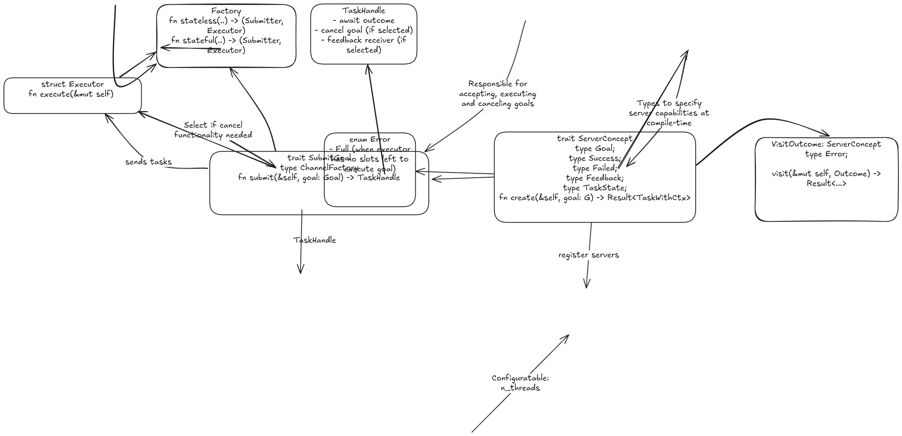

# Actio

Library for long‑running IO bound async tasks that optionally produce a feedback updates, support cancellation, and eventually resolve to a terminal outcome.

Feedback and cancellation are selected at compile time, so you don’t pay for capabilities you don’t opt in to.

### Capabilities

- **Feedback channel** - Progress updates while the task runs. Implemented by default via `tokio::watch` channel, however user is free to implement `FeedbackReceiverMarker` to integrate 3rd party channels (and use corresponding `Sender` part in `ServerConcept` implementation).
- **Cancellation** - Event-based cancellation with optional context
- **Task state snapshot** - Capture last task execution state and provide it to client wrapped in `Outcome::Cancelled`
- **Stateful servers** - Visit the server and update its internal state based on `Outcome`
- **Invariants enforced by type system** - Task can be cancelled only once, awaiting `Outcome` consumes task handle

### When to use
If you want long-running async tasks with a client↔server shape but you don’t need a distributed system boundary, `actio` can be a good fit.

### Design Diagram


### Things to keep in mind
When implementing `ServerConcept::create` the provided task must be cancellation-correct: if the task is dropped/aborted at an `await` point, it must not leave your system in an invalid state (e.g. half-written files, leaked permits/locks, corrupted in-memory invariants, or “committed” side effects without recording them).

A good deep dive on this (including the difference between “cancel-safe” operations and broader cancellation correctness) is Rain’s post: <https://sunshowers.io/posts/cancelling-async-rust>.

## Quickstart

`actio` has two moving parts:
- A submitter (client-side) returned by `Factory::{stateless,stateful}`.
- An `Executor` (server-side) that must be driven (e.g. in a Tokio task).

```rust
use std::time::Duration;

use actio::{
    Outcome, ServerConcept, ServerTask, SubmitGoal, WithFeedbackWatch, WithTaskStateSnapshotWatch,
};
use tokio::{
    sync::watch,
    time::{Instant, sleep},
};

struct Server;

// Define your interface contract
pub struct Succeed {
    pub steps_done: u32,
}
pub struct Failed;
pub struct Goal {
    pub steps: u32,
}

pub struct Feedback {
    pub step: u32,
    pub total: u32,
}

#[derive(Clone)] // Required by the watch channel not framework itself
pub struct TaskState {
    pub started_at: Instant,
    pub last_step: u32,
}

impl ServerConcept for Server {
    type Goal = Goal;
    type Succeed = Succeed;
    type Failed = Failed;
    /// actio::NoFeedback if you opt out of feedback capability or
    /// actio::WithFeedback<R> where R: FeedbackReceiverMarker if you want to add custom feedback receiver
    type Feedback = WithFeedbackWatch<Feedback>;
    /// actio::NoTaskStateSnapshot if you opt out of providing task state snapshot or
    /// actio::WithTaskStateSnapshot<R> where R: TaskStateSnapshotReceiver if you want to add custom state snapshot receiver
    type TaskState = WithTaskStateSnapshotWatch<TaskState>;
    fn create(&mut self, goal: Self::Goal) -> ServerTask<Self> {
        let (fb_tx, fb_rx) = watch::channel(Feedback {
            step: 0,
            total: goal.steps,
        });
        let (ts_tx, ts_rx) = watch::channel(TaskState {
            started_at: Instant::now(),
            last_step: 0,
        });

        let task = async move {
            let steps = goal.steps;
            let started_at = Instant::now();
            for step in 1..=goal.steps {
                sleep(Duration::from_millis(20)).await;
                let _ = ts_tx.send(TaskState {
                    started_at,
                    last_step: step,
                });

                let _ = fb_tx.send(Feedback { step, total: steps });
            }

            Outcome::Succeed(Succeed { steps_done: steps })
        };

        // it is mandatory to provide receivers if capabilities are active
        ServerTask::<Self>::new(Box::pin(task))
            .with_task_state(ts_rx)
            .with_feedback(fb_rx)
    }
}

#[tokio::main(flavor = "current_thread")]
async fn main() -> anyhow::Result<()> {
    let (mut submitter, mut exec) = actio::Factory::stateless::<Server, actio::CancelChannel>(16); // or actio::NoCancel if you opt out of cancellation capability

    // Spawned here for convenience (when you do not care about structured concurrency)
    tokio::spawn(async move {
        exec.execute().await;
    });

    let mut server = Server {};
    let handle = submitter.submit(&mut server, Goal { steps: 10 })?;
    // or can call handle.cancel() to cancel the goal
    let _outcome = handle.into_outcome_receiver().await?;

    Ok(())
}
```
For the stateful version please see `tests/stateful.rs` test case for the details.

### Runtime
`actio` currently depends on `tokio`, however if needed some work might be dedicated to try to make it runtime agnostic.

### Comparison with ROS actions

`actio` aims to provide functionality similar to ROS 2 actions (goal, feedback, result), but with a different set of tradeoffs.
​

In-process lifecycle: `actio` keeps the entire action lifecycle in the same process, avoiding the ROS 2 action transport endpoints (topics like `/action/status` and `/action/feedback`, plus services like `/action/send_goal`, `/action/cancel_goal`, and `/action/get_result`) as well as the associated discovery and (de)serialization costs.
​

Typed handles instead of UUIDs: ROS 2 uses a goal ID (UUID) to identify goals across distributed clients; `actio` can expose strongly typed goal/task handles because the client and server share an address space.
​

Cancellation semantics: In ROS 2, cancellation is requested via the `/action/cancel_goal` service, and whether a goal ultimately transitions to `CANCELED` is indicated via the status topic and the result service. In `actio`, cancellation can be modeled as an in-process signal/event and paired with a “visit/update state” mechanism to keep server logic clean.